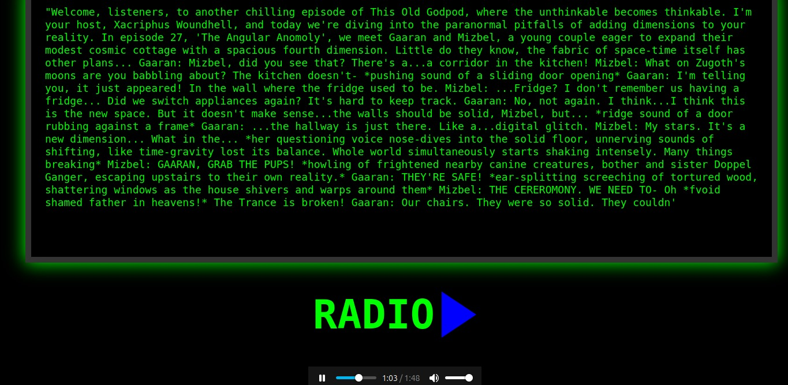

# Interdimensional Broadcast Radio Agent (Proof of Concept)

A radio from across impossible dimension that has only one button - "Change channel".


Make sure your backend AI & TTS services are running locally:

Starts as:
```
npm init -y
npm install express@4
node server.js
```

- AI completion at http://127.0.0.1:5000/v1/chat/completions
- I made Kokoro into a TTS API at http://127.0.0.1:9000/tts
- Worldbuilding data.json in the same directory as index.html

## Components
- node js (but you can write your own Agent)
- [OobaBooga API](https://github.com/oobabooga/text-generation-webui)
- TTS (I used Kokoro)

## How it works
- It has a JSON file of pre-generated impossible universes
- pipes it to a local OobaBooga API LLM and a character card "Assistant"
- Generates individual components for a new world:
  - Core Twist
  - World State
  - Dominant Species
  - Culture
  - Technology Level
  - Politics
  - Fashion
  - Laws of Nature
  - Snapshot
  - Tone
- Makes you land in the middle of whatever is playing on the station
- Creates a TTS broadcast (in my case - Kokoro)

